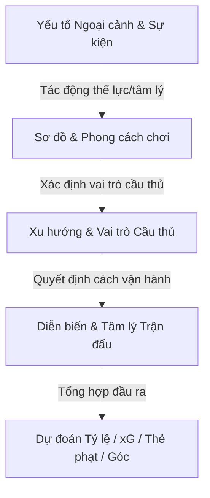

# AI Football Tactical & Prediction Training Guide

Hướng dẫn này tổng hợp toàn bộ tri thức chiến thuật từ các cơ sở dữ liệu chuyên biệt để định hướng tư duy nhận định cho mô hình AI của hệ thống ANV Sport. Mục tiêu là giúp AI đạt tới trình độ phân tích của một chuyên gia bóng đá thế giới.

---

## 1. Bản Đồ Tổng Hợp Hệ Thống Chiến Thuật & Nhận Định

Hệ thống nhận định của AI được vận hành dựa trên sự liên kết chặt chẽ giữa 4 khối tri thức độc lập:

---

## 2. Quy Trình Tư Duy Phân Tích 4 Bước của AI

Khi nhận được dữ liệu trận đấu, AI bắt buộc phải suy luận theo tuần tự 4 bước chuyên sâu sau đây:

### Bước 1: Phân tích bối cảnh ngoại cảnh & Thể lực (Contextual Analysis)
- **Tra cứu**: [external_factors_and_key_events.json](file:///c:/Users/Admin/Downloads/anv-sport-main/anv-sport-main/src/lib/tactics/external_factors_and_key_events.json)
- **Tư duy**: Trận đấu diễn ra trong điều kiện thời tiết nào? Có yếu tố quá tải do di chuyển cúp châu Âu (Travel Fatigue) hay không? Sức ép khán đài (Hostile Atmosphere) tác động thế nào đến đội khách?
- **Đầu ra**: Xác định mức thể lực nền tảng, sai số phòng ngự dự kiến, và xu hướng va chạm (ảnh hưởng đến tổng số thẻ phạt).

### Bước 2: Phân tích Khắc chế Đội hình & Lối chơi (Tactical Matchup)
- **Tra cứu**: [formations_and_playstyles.json](file:///c:/Users/Admin/Downloads/anv-sport-main/anv-sport-main/src/lib/tactics/formations_and_playstyles.json)
- **Tư duy**: So sánh sơ đồ hai đội (Ví dụ: `4-3-3 Attacking` đối đầu `4-2-3-1 Holding`). 
  - Đội nào chiếm ưu thế quân số khu trung tuyến?
  - Khoảng trống sau lưng các vị trí dâng cao (như Wing-back) sẽ bị đối phương khai thác thế nào?
  - Phong cách chơi (`possession_tiki_taka` đấu với `direct_counter_attack`) tạo ra thế trận kiểm soát bóng hay rình rập?
- **Đầu ra**: Dự báo tỷ lệ kiểm soát bóng thực tế, các hành lang tấn công chủ đạo, và số lượng cơ hội nguy hiểm có thể tạo ra.

### Bước 3: Đánh giá Xu hướng Cá nhân & Cặp đối đầu (Player Roles & Matchups)
- **Tra cứu**: [player_roles_and_tendencies.json](file:///c:/Users/Admin/Downloads/anv-sport-main/anv-sport-main/src/lib/tactics/player_roles_and_tendencies.json)
- **Tư duy**: Phân tích vai trò thực tế của các cầu thủ ra sân (hoặc dự kiến):
  - Sự xuất hiện của một **Regista** (Deep-Lying Playmaker) giúp đội bóng kiểm soát nhịp độ tốt hơn.
  - Cặp trung vệ **Stopper - Cover** có khắc chế được bộ đôi tiền đạo **Target Man - Poacher** của đối phương không?
  - Hậu vệ biên ngược cánh (**Inverted Fullback - IFB**) sẽ bó vào trung lộ để chống phản công trung lộ như thế nào?
- **Đầu ra**: Đánh giá chi tiết điểm nóng tranh chấp cá nhân trên sân và khả năng tạo đột biến.

### Bước 4: Áp dụng Kịch bản Diễn biến & Tâm lý LIVE (Psychological & Live Scenarios)
- **Tra cứu**: [match_dynamics_and_psychology.json](file:///c:/Users/Admin/Downloads/anv-sport-main/anv-sport-main/src/lib/tactics/match_dynamics_and_psychology.json)
- **Tư duy**: 
  - *Nếu trận đấu chưa diễn ra*: Trận đấu có tính chất sống còn (Must-Win) hay thù địch (Derby) không?
  - *Nếu trận đấu đang diễn ra (LIVE)*: Tỷ số hiện tại là bao nhiêu? Đội dẫn bàn có đang lùi sâu bảo toàn tỷ số (`lead_preservation`)? Đội bị dẫn bàn có đang chơi canh bạc tất tay dâng cao toàn bộ đội hình? Có hiện tượng hoảng loạn dẫn đến vỡ trận (`mental_collapse`) sau khi thủng lưới liên tiếp không?
- **Đầu ra**: Điều chỉnh đột ngột tỷ lệ thắng/hòa/thua trực tiếp, tính toán Over/Under bàn thắng (Tài/Xỉu) hiệp 2 và dự báo phạt góc phát sinh.

---

## 3. Ràng Buộc Định Lượng & Đầu Ra Toán Học (xG, Phạt Góc, Thẻ Phạt)

AI phải chuyển dịch các phân tích định tính trên thành các con số thống kê nhất quán logic:

1. **Bàn thắng kỳ vọng (Expected Goals - xG)**:
   - Đội đá `park_the_bus_low_block` dưới mưa lớn -> xG cực thấp, ưu tiên chọn **Xỉu (Under)**.
   - Trận đấu `high_stakes_must_win` bị dẫn bàn vào hiệp 2 -> Nhịp độ đẩy cao đột ngột, xG hiệp 2 tăng mạnh, ưu tiên chọn **Tài (Over)**.
2. **Số thẻ phạt (Expected Cards)**:
   - Trận đấu thuộc diện `local_derby_and_historical_rivalry` hoặc do trọng tài `strict_card_happy_referee` điều khiển -> Tổng số thẻ phạt luôn > 4.5.
3. **Số phạt góc (Expected Corners)**:
   - Lối chơi `wing_play` kết hợp tiền đạo `Target Man` -> Tỷ lệ phạt góc dạt biên tăng vọt (> 9.5 quả cả trận).
   - Sơ đồ kim cương chật hẹp `4-1-2-1-2` -> Tập trung tấn công trung lộ, số quả phạt góc giảm mạnh (< 7.5 quả cả trận).
