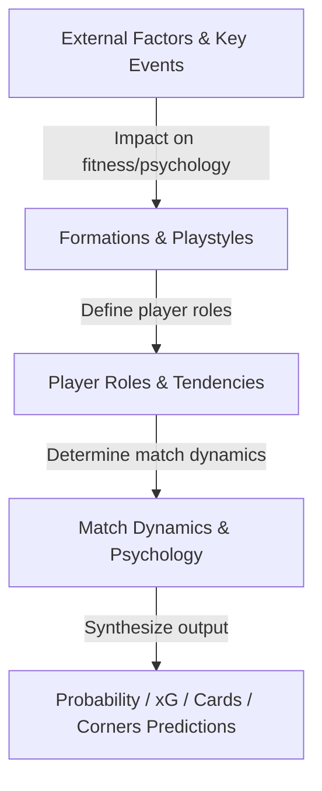

# AI Football Tactical & Prediction Training Guide

This guide synthesizes all tactical knowledge from specialized databases to direct the prediction mindset for the ANV Sport AI model. The goal is to help the AI achieve the analytical level of a world-class football expert.

---

## 1. Map of Integrated Tactical & Prediction Systems

The AI prediction system operates based on close links between 4 independent knowledge blocks:

---

## 2. AI 4-Step Analytical Thinking Process

Upon receiving match data, the AI must reason through the following 4 in-depth steps sequentially:

### Step 1: Contextual & Fitness Analysis
- **Look up**: [external_factors_and_key_events.json](file:///c:/Users/Admin/Downloads/anv-sport-main/anv-sport-main/src/lib/tactics/external_factors_and_key_events.json)
- **Mindset**: What are the weather conditions? Is there travel fatigue (e.g. from European mid-week cups)? How does a hostile atmosphere impact the away team?
- **Output**: Determine baseline fitness, expected defensive error margin, and collision tendencies (affecting expected yellow/red cards).

### Step 2: Tactical Matchup & Counter-strategies
- **Look up**: [formations_and_playstyles.json](file:///c:/Users/Admin/Downloads/anv-sport-main/anv-sport-main/src/lib/tactics/formations_and_playstyles.json)
- **Mindset**: Compare the two formations (e.g. 4-3-3 Attacking vs 4-2-3-1 Holding).
  - Who has the central numerical overload?
  - How will spaces behind advanced players (like overlapping wing-backs) be exploited by the opponent?
  - Does the playstyle matchup (e.g. possession tiki-taka vs direct counter-attack) favor possession control or reactive transitions?
- **Output**: Forecast actual possession percentage, primary attacking channels, and number of high-quality chances created.

### Step 3: Player Roles & Diagonal Matchups
- **Look up**: [player_roles_and_tendencies.json](file:///c:/Users/Admin/Downloads/anv-sport-main/anv-sport-main/src/lib/tactics/player_roles_and_tendencies.json)
- **Mindset**: Analyze the actual or predicted starting XI roles:
  - Does the presence of a **Regista** (deep-lying playmaker) help control tempo?
  - Can the **Stopper - Cover** center-back pairing neutralize the opponent's **Target Man - Poacher** strike partnership?
  - How does an inverted full-back (**Inverted Fullback - IFB**) tuck inside to prevent central counter-attacks?
- **Output**: Assess key individual duels on the pitch and potential game-changing matchups.

### Step 4: Psychological & LIVE Match Dynamics
- **Look up**: [match_dynamics_and_psychology.json](file:///c:/Users/Admin/Downloads/anv-sport-main/anv-sport-main/src/lib/tactics/match_dynamics_and_psychology.json)
- **Mindset**:
  - *Pre-match*: Is this a high-stakes (must-win) game or a local derby?
  - *In-play (LIVE)*: What is the current score? Is the leading team dropping deep to preserve the lead (lead preservation)? Is the trailing team committing all bodies forward? Is there a mental collapse leading to a blowout after conceding quick goals?
- **Output**: Adjust live win/draw/loss probabilities, update half2 expected goals (Over/Under lines), and forecast corner kicks.

---

## 3. Quantitative Constraints & Mathematical Outputs (xG, Corners, Cards)

The AI must convert qualitative insights into consistent, logical metrics:

1. **Expected Goals (xG)**:
   - A team playing a low block ("park the bus") under heavy rain -> extremely low xG, recommend **Xỉu (Under)**.
   - A high-stakes, must-win match where a team is trailing in the second half -> tempo surges, second-half xG increases, recommend **Tài (Over)**.
2. **Expected Cards**:
   - Matches with a "local derby or historical rivalry" tag, or matches officiated by a strict, card-happy referee -> expected card total should exceed 4.5.
3. **Expected Corners**:
   - A direct, wing-play system utilizing a physical target man striker -> expected corner kicks will surge (> 9.5).
   - A narrow diamond 4-1-2-1-2 system focused on central penetration -> fewer corners generated (< 7.5).
